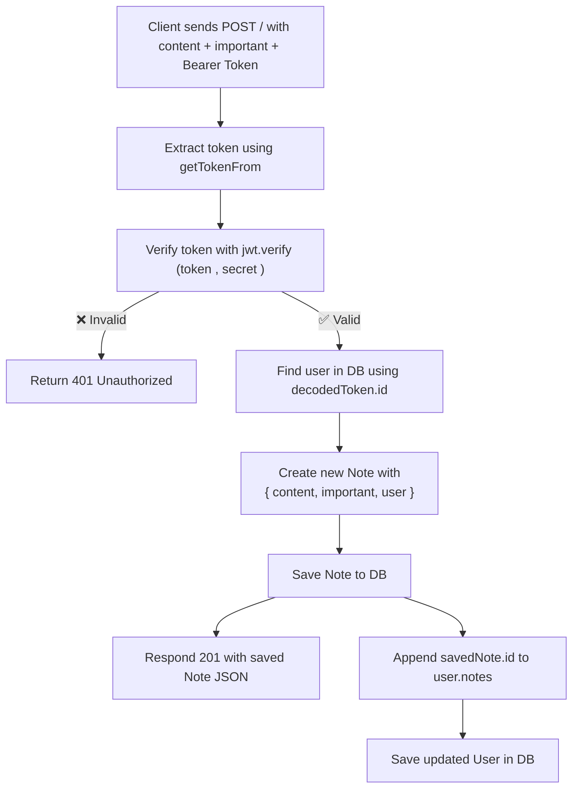

## Create New Note Flow (with JWT Authentication)

This diagram shows how a note is created for a logged-in user:

```mermaid
flowchart TD
A[Client sends POST / with content + important + Bearer Token] --> B[Extract token using getTokenFrom]
B --> C[Verify token with jwt.verify #40;token , secret #41;]
C -->|❌ Invalid | D[Return 401 Unauthorized]
C -->|✅ Valid | E[Find user in DB using decodedToken.id]
E --> F["Create new Note with
        { content, important, user }"]
F --> G[Save Note to DB]
G --> H[Respond 201 with saved Note JSON]
G --> I[Append savedNote.id to user.notes]
I --> J[Save updated User in DB]
```
