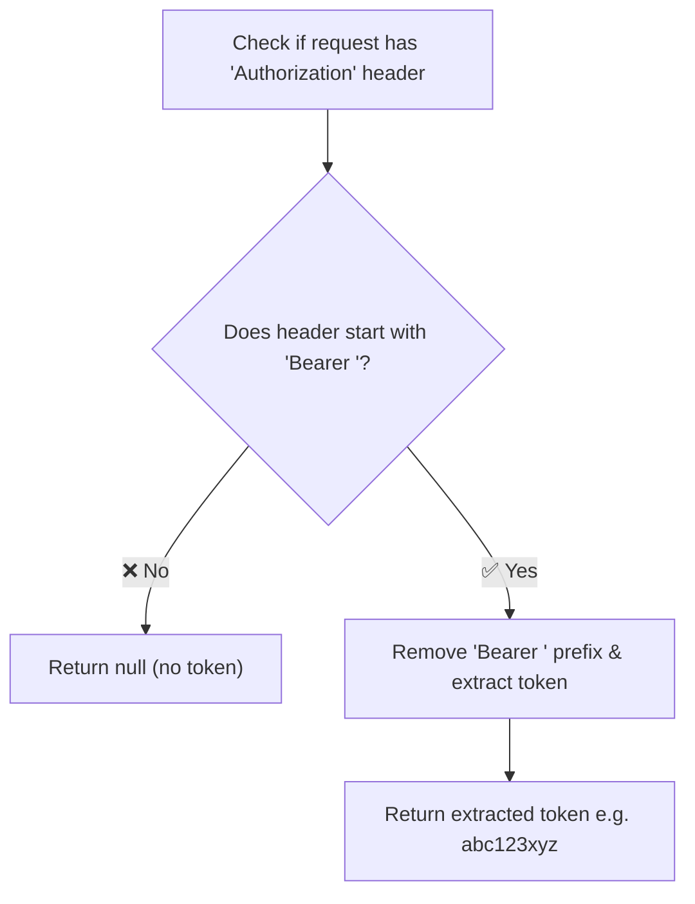

## Get Token from Authorization Header

This diagram shows how a token is extracted

```mermaid
flowchart TD

B1["Check if request has 'Authorization' header"]
B2{"Does header start with 'Bearer '? "}

B1 --> B2
B2 -- ❌ No --> B3["Return null (no token)"]
B2 -- ✅ Yes --> B4["Remove 'Bearer ' prefix & extract token"]
B4 --> B5["Return extracted token e.g. abc123xyz"]

```
