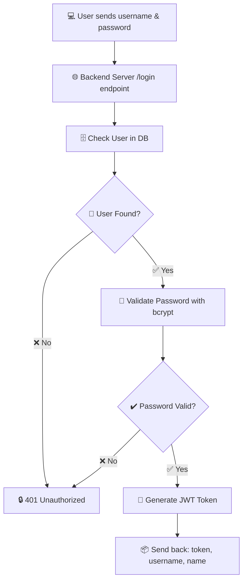

```mermaid

flowchart TD
    A[💻 User sends username & password] --> B[🌐 Backend Server /login endpoint]
    B --> C[🗄️ Check User in DB]
    C --> D{👤 User Found?}
    D -- ❌ No --> E[🔒 401 Unauthorized]
    D -- ✅ Yes --> F[🔑 Validate Password with bcrypt]
    F --> G{✔️ Password Valid?}
    G -- ❌ No --> E
    G -- ✅ Yes --> H[🪪 Generate JWT Token]
    H --> I[📦 Send back: token, username, name]
```
