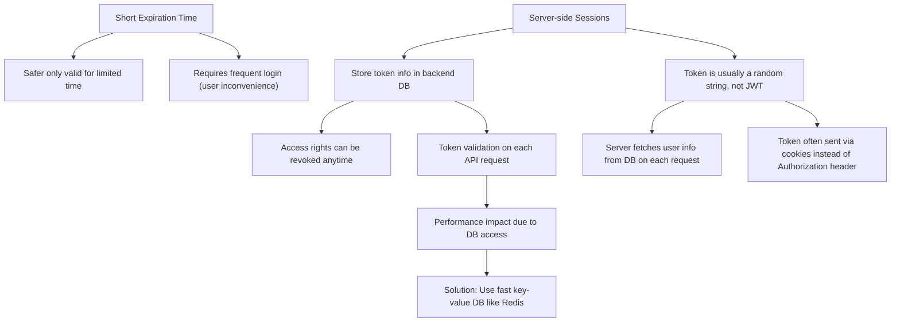

# Token Expiration vs Server-side Sessions

---

**Explanation:**

- **Short expiration time:** Limits risk if token is stolen, but users log in more often.
- **Server-side sessions:** More flexible and revocable, but adds backend complexity and performance costs.
- **Optimization:** Use Redis or similar for fast session validation.
- **Token type:** Random string with server fetching user info on each request.
